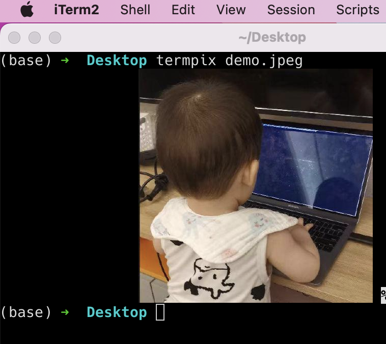
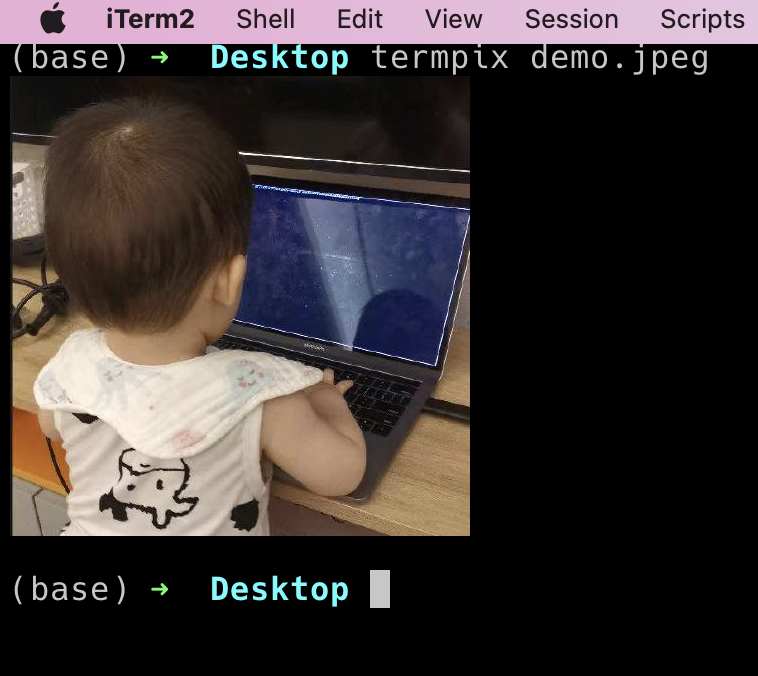
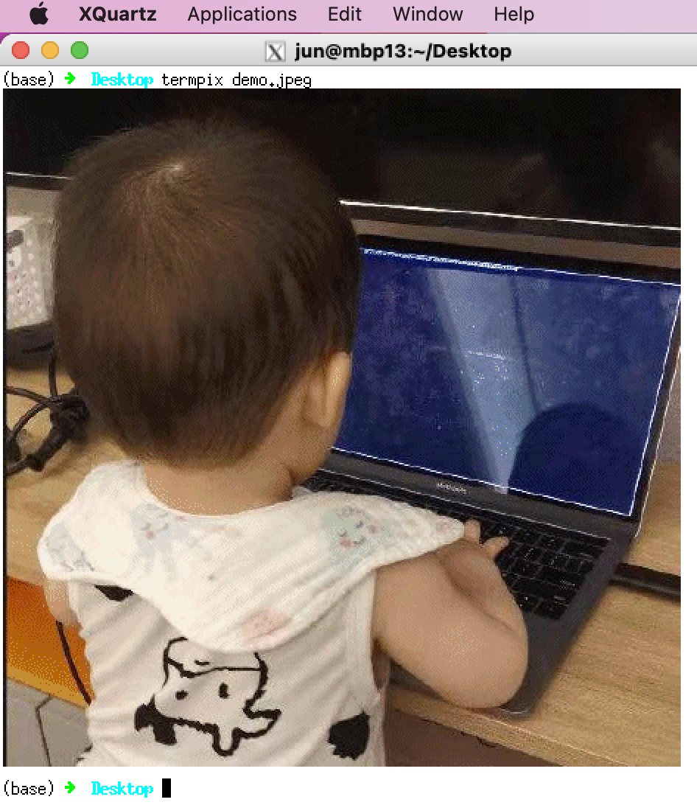

# termimg
A terminal image viewer.
Supported graphic protocols are :
1. Kitty's protocol
2. Sixel
3. iTerm's protocol
4. mosaic (port from [termpix](https://github.com/hopey-dishwasher/termpix)

Usage:
```
    termimg : display image from <file> in an terminal

    Usage:
      termimg <file> [--protocol <protocol>]
      termimg --stdio
      termimg --list-protocol

    Options:
      --protocol <protocol>         One of kitty,mosaic,auto, [Default:auto]
      --list-protocol               Show protocols
```
# Showcases
## Kitty


## iterm


## sixel (xterm)


# License
Apache 2.0 license


